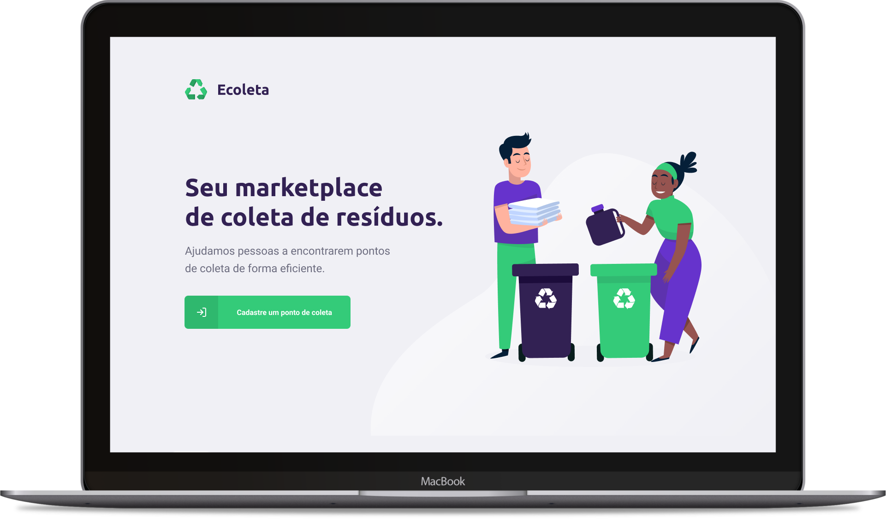

<h1 align="center">
  
  <div>
    
    
    
    
  </div>
</h1>

# Next Level Week #01 - Ecoleta

## Projeto

Ecoleta é um projeto desenvolvido com base na Semana Nacional do Meio Ambiente. O objetivo é conectar pessoas a empresas que coletam resíduos eletrônicos, orgânicos, lâmpadas, baterias, óleo de cozinha etc.

<h1 align="center">
  
  
</h1>

## Layout

Disponível em [Figma - Ecoleta](https://www.figma.com/file/9TlOcj6l7D05fZhU12xWT3/Ecoleta-(Booster)).

## Instalação

### Requisitos
- [Git](https://git-scm.com)
- [Node.js](https://nodejs.org/)
- [Yarn](https://yarnpkg.com/)

### Instalação da API 

```bash
# Clonar repositório
$ git clone https://github.com/renatomarquesteles/nlw-ecoleta.git

# Entrar na pasta server
$ cd nlw-ecoleta/server

# Instalar dependencias
$ yarn

# Rodar migrations do banco de dados
$ yarn knex:migrate

# Rodar Seeds para popular o banco de dados
$ yarn knex:seed

# Rodar servidor
$ yarn dev

# Estará rodando na porta 3333
```

<p align="center">
  <a href="https://insomnia.rest/run/?label=NLW%20%2301%20-%20Ecoleta&uri=https%3A%2F%2Fraw.githubusercontent.com%2Frenatomarquesteles%2Fnlw-ecoleta%2Fmaster%2FInsomnia_NLW_01.json" target="_blank"></a>
</p>

### Instalação da interface Web

```bash
# Clonar repositório
$ git clone https://github.com/renatomarquesteles/nlw-ecoleta.git

# Entrar na pasta web
$ cd nlw-ecoleta/web

# Instalar dependencias
$ yarn

# Rodar front-end
$ yarn start

# Estará rodando na porta 3000
```

### Instalação Mobile

```bash
# Clonar repositório
$ git clone https://github.com/renatomarquesteles/nlw-ecoleta.git

# Entrar na pasta mobile
$ cd nlw-ecoleta/mobile

# Instalar dependencias
$ yarn

# Rodar o bundler
$ yarn start

# Expo irá abrir automaticamente, escanear o QRCode utilizando o app Expo instalado no seu smartphone

# Se ocorrer algum problema com as fontes, execute:
$ expo install expo-font @expo-google-fonts/ubuntu @expo-google-fonts/roboto

# e rode novamente o bundler (Ctrl+C para parar)
$ yarn start
```
